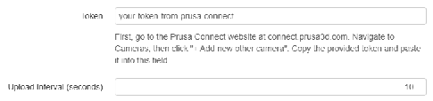

# Prusa Connect Uploader

An OctoPrint plugin that automatically uploads snapshots from your 3D printer's camera to [Prusa Connect](https://connect.prusa3d.com), allowing enhanced remote monitoring and management of print jobs.

---

## 📦 Installation

You can install the latest version manually:

1. Open **Settings > Plugin Manager > Get More > ...from URL**
2. Enter:
> https://github.com/rizz360/prusa_connect_uploader/archive/refs/heads/main.zip

> 🔁 This URL always points to the latest version on the `main` branch.  
> To install a specific version, use the format:
> `https://github.com/rizz360/prusa_connect_uploader/archive/refs/tags/<VERSION>.zip`

---

## ⚙️ Configuration

1. Go to the [Prusa Connect](https://connect.prusa3d.com) dashboard.
2. Navigate to **Cameras** → **+ Add new other camera**
3. Copy the provided token.
4. In OctoPrint, go to **Settings > Prusa Connect Uploader**
5. Paste the token and adjust the upload interval if needed.

---

## 🖼️ Webcam Notes

This plugin currently uses OctoPrint’s legacy webcam snapshot API, which may change in future OctoPrint versions. If snapshot capture fails, check your **Webcam & Timelapse** settings in OctoPrint.

---

## ❓ Troubleshooting

- If the settings page appears blank:
  - Restart OctoPrint
  - Clear your browser cache
  - Disable and re-enable the plugin from Plugin Manager

---

## 🙌 Acknowledgments

- Built with the [OctoPrint plugin system](https://docs.octoprint.org/en/master/plugins/index.html)
- Thanks to the OctoPrint and Prusa communities!

---

## 📄 License

MIT – see [`LICENSE.md`](LICENSE.md) for details.
