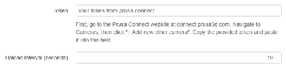

# Prusa Connect Uploader

An OctoPrint plugin that automatically uploads snapshots from your 3D printer's camera to [Prusa Connect](https://connect.prusa3d.com), allowing enhanced remote monitoring and management of print jobs.

---

## ✅ Requirements

- OctoPrint **1.9 or newer** (the plugin uses OctoPrint's webcam provider API)
- A webcam configured in OctoPrint with a working snapshot URL
  (**Settings > Webcam & Timelapse** — the snapshot must work there first)
- A free [Prusa Connect](https://connect.prusa3d.com) account

---

## 📦 Installation

1. Open **Settings > Plugin Manager > Get More > ...from URL**
2. Enter:
> https://github.com/rizz360/prusa_connect_uploader/archive/refs/heads/main.zip

> 🔁 This URL always points to the latest code on the `main` branch.
> To install a specific version, use a release tag, e.g.
> `https://github.com/rizz360/prusa_connect_uploader/archive/refs/tags/v1.1.0.zip`
> — see the [releases page](https://github.com/rizz360/prusa_connect_uploader/releases) for available versions.

Once installed, updates are offered automatically through OctoPrint's
**Software Update** mechanism (plugin version 1.1.0 and newer).

---

## ⚙️ Configuration

1. Go to the [Prusa Connect](https://connect.prusa3d.com) dashboard.
2. Navigate to **Cameras** → **+ Add new other camera**
3. Copy the provided token.
4. In OctoPrint, go to **Settings > Prusa Connect Uploader**
5. Paste the token and adjust the upload interval (default: every 10 seconds) if needed.

---

## 🖼️ Webcam Notes

This plugin uses OctoPrint's webcam provider API (OctoPrint 1.9+) and respects your snapshot URL, authentication and SSL settings. If snapshot capture fails, check your **Webcam & Timelapse** settings in OctoPrint and verify the snapshot URL works there.

---

## ❓ Troubleshooting

**The settings page appears blank:**
- Restart OctoPrint
- Clear your browser cache
- Disable and re-enable the plugin from Plugin Manager

**The camera is registered in Prusa Connect but no picture arrives:**
- Verify the snapshot works inside OctoPrint first (**Settings > Webcam & Timelapse**)
- Check `octoprint.log` for messages from `prusa_connect_uploader`
- A `403` / "rejected the upload" error means the token is invalid or already
  bound to a different camera. Create a **new** "other camera" in Prusa Connect
  and paste the fresh token into the plugin settings.
- After three consecutive authorization failures the plugin pauses uploads;
  saving the plugin settings or restarting OctoPrint resumes them.

---

## 🙌 Acknowledgments

- Built with the [OctoPrint plugin system](https://docs.octoprint.org/en/master/plugins/index.html)
- Thanks to the OctoPrint and Prusa communities!

---

## 📄 License

MIT – see [`LICENSE.md`](LICENSE.md) for details.
